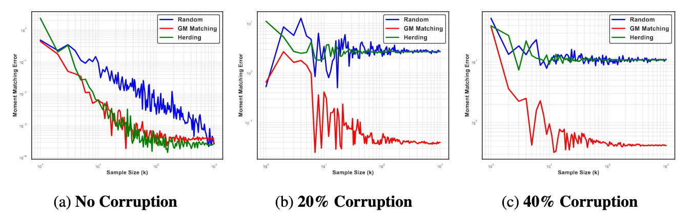

# 🧠 Robust k-Subset Selection from Noisy data

---
Official implementation of the ICML 2025 paper:  
**[Geometric Median (GM) Matching for Robust k-Subset Selection from Noisy Data](https://openreview.net/pdf?id=pxfpGbeVx2)**     
[Anish Acharya](https://scholar.google.com/citations?user=uBmgGMAAAAAJ&hl=en), [Sujay Sanghavi](https://scholar.google.com/citations?user=O-DazBUAAAAJ), [Alex Dimakis](https://scholar.google.com/citations?user=JSFmVQEAAAAJ), and Inderjit S. Dhillon.

---

## 📋 Citation

If you find this work useful in your research, please consider citing:

```bibtex
@inproceedings{
  acharya2025geometric,
  title={Geometric Median ({GM}) Matching for Robust k-Subset Selection from Noisy Data},
  author={Anish Acharya and Sujay Sanghavi and Alex Dimakis and Inderjit S Dhillon},
  booktitle={Forty-second International Conference on Machine Learning},
  year={2025},
  url={https://openreview.net/forum?id=pxfpGbeVx2}
}

---

<p align="center">
  
</p>

Modern deep learning thrives on massive datasets — but training on all available data is often prohibitively expensive, both computationally and financially.
What if we could select just a small, representative subset of the data and still train high-performing models?

Welcome to the world of data pruning, where the goal is to select a k-subset of training examples that captures the core structure and diversity of the entire dataset.  

But there's a catch: real-world data is often noisy. Labels may be incorrect, features can be corrupted, and adversarial outliers lurk in the shadows.
Most existing pruning strategies fail under such conditions — they simply weren't built for robustness.

In our latest work, we introduce a robust alternative: Geometric Median (GM) Matching — 
a theoretically principled and practically scalable approach that reliably selects high-quality subsets even when up to 50% of the data is arbitrarily corrupted.

---

## 🚧 The Challenge: Robustness vs. Diversity

Most existing pruning methods rely on **importance scores** — think of examples closest to the class centroid or 
hardest to learn. These methods perform well in clean settings.
But under **gross corruption** — mislabeled data, noisy features, or adversarial examples — these strategies fail.
This leads to a trade-off:
- **Robustness**: Retain only the easiest, most prototypical examples → safe but not diverse.
- **Diversity**: Include hard examples → informative but vulnerable to noise.

**How can we better navigate this trade-off ?**

---

### 🎯 Robust Moment Matching

A principled approach to data pruning is **moment matching** — selecting a subset of examples such that the 
**empirical mean of the subset** approximates that of the full dataset. This strategy works well in clean settings.

However, under data corruption (e.g., mislabeled or adversarial examples), the **empirical mean is unreliable** 
— even a single outlier can arbitrarily distort it.

To counter this, we introduce **Robust Moment Matching** — where we match the subset's mean to a 
**robust estimator** of the dataset's central tendency, rather than the standard empirical mean.

---

### 🛡️ Geometric Median: A Robust Estimator

The **Geometric Median (GM)** is a classic robust estimator that remains **resilient to up to 50% corrupted data**. 
Unlike the mean (which minimizes squared distances), the GM minimizes the **sum of Euclidean distances** to all points.

#### 📐 Definition
Given a set of points $\{x_1, x_2, \dots, x_n\} \subset \mathbb{R}^d$, the Geometric Median $\mu_{\text{GM}}$ 
is defined as:

$$
\\ \mu_{GM} = \underset{z \in \mathbb{R}^d}{\arg\min} \sum_{i=1}^n || z - x_i ||
$$

This estimator is **translation invariant**, **resistant to outliers**, 
and lies within the **convex hull** of the clean samples.

<p align="center">
  
</p>

### ⚙️ Algorithm: GM Matching

We now describe the **GM Matching** algorithm that selects a subset of \( k \) points whose empirical mean best approximates the Geometric Median of the full dataset in an embedding space.

```
# GM Matching (Simplified Pseudocode)

Inputs:
- D: dataset of n examples
- ϕ: encoder mapping inputs to embedding space
- γ: fraction for GM estimation
- B: number of batches
- k: size of subset to select

# Step 1: Compute embeddings
Φ = [ϕ(x) for x in D]

# Step 2: Subsample γ-fraction for robust GM estimation
Φ_GM = random_subset(Φ, fraction=γ)

# Step 3: Compute ε-approximate Geometric Median
μ_GM = geometric_median(Φ_GM)

# Step 4: Partition data into B batches
batches = partition(Φ, B)

# Step 5: Greedy selection loop
θ = μ_GM
DS = []

for Φ_b in batches:
    for _ in range(k // B):
        # Select point closest to residual direction
        ω = argmax(dot(θ, ω_i) for ω_i in Φ_b)
        DS.append(ω)
        
        # Update direction vector
        θ = θ + (μ_GM - ω)
        
        # Remove selected point
        Φ_b.remove(ω)

return DS
```

<p align="center">
  
</p>

## 🚀 Installation and Usage

### Installation

1. Clone the repository:
```bash
git clone https://github.com/yourusername/GM-Matching.git
cd GM-Matching
```

2. Install the required dependencies:
```bash
pip install torch torchvision pytorch-lightning tqdm numpy
```

### Running the Code

The main script `run_classify_coreset.py` provides a boilerplate implementation for running experiments with different configurations. It includes a standard training loop with ResNet18 on CIFAR-10, but you can modify it to use your own models and datasets. Here are some example commands:

1. Run on CIFAR-10 with no noise:
```bash
python run_classify_coreset.py --dataset cifar10 --coreset_method random --coreset_size_dataset 0.1
```

2. Run on CIFAR-10 with 20% label noise:
```bash
python run_classify_coreset.py --dataset cifar10 --noise_fraction 0.2 --coreset_method gm --coreset_size_dataset 0.1
```

### Command Line Arguments

- `--dataset`: Dataset to use (currently supports "cifar10")
- `--noise_fraction`: Fraction of labels to corrupt (between 0 and 1)
- `--coreset_method`: Method for subset selection ("random" or "gm")
- `--coreset_size_dataset`: Size of the subset as a fraction of the full dataset
- `--num_repetitions`: Number of times to repeat the experiment
- `--log_filename`: Path to save the logs

The results will be saved in the specified log file, which can be used for further analysis.

